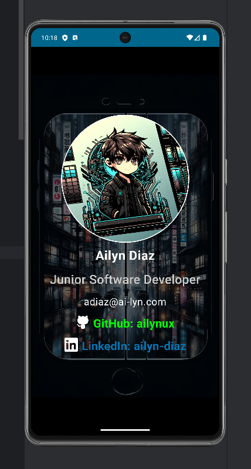

<h1 align="center">🌟ᗷᑌᔕIᑎEᔕᔕ ᑕᗩᖇᗪ KOTᒪIᑎ🌟</h1>
<h3 align="center">—(••÷[ 𝗪𝗲𝗹𝗰𝗼𝗺𝗲 𝘁𝗼 𝘁𝗵𝗲 𝗕𝘂𝘀𝗶𝗻𝗲𝘀𝘀 𝗖𝗮𝗿𝗱 𝗞𝗼𝘁𝗹𝗶𝗻 𝗽𝗿𝗼𝗷𝗲𝗰𝘁! 💼✨ ]÷••)—</h3>

<div align="center">
  <div style="display: flex; align-items: flex-start;">
    
  </div>
  <div style="display: flex; flex-direction: column; align-items: flex-end; margin-top: -20px;">
    
    
  </div>
</div>


<p align="center">
  <a href="www.linkedin.com/in/ailyn-diaz-802943225/"></a>
  &nbsp;&nbsp;
  &nbsp;&nbsp;
  &nbsp;&nbsp;
</p>

## (⌐■_■) Features I provide: (⌐■_■):
- Create personalized business cards with ease.
- Customize your card with your name, job title, contact details, and more.
- Save and share your business card digitally.
- Impress everyone with your unique and professional-looking card!

## Getting Started:
1. Clone this repository to your local machine:
   
   ```shell
   git clone https://github.com/ailynux/BusinessCard-Kotlin.git
   ```
3. Open the project in Android Studio.
4. Customize the app to fit your style and preferences.
5. Build and run the app on your Android device or emulator.
6. Share your beautiful business cards with the world! 🌎✉️

## Contributing:
Feel free to contribute to this project by creating issues, suggesting new features, or submitting pull requests. 
